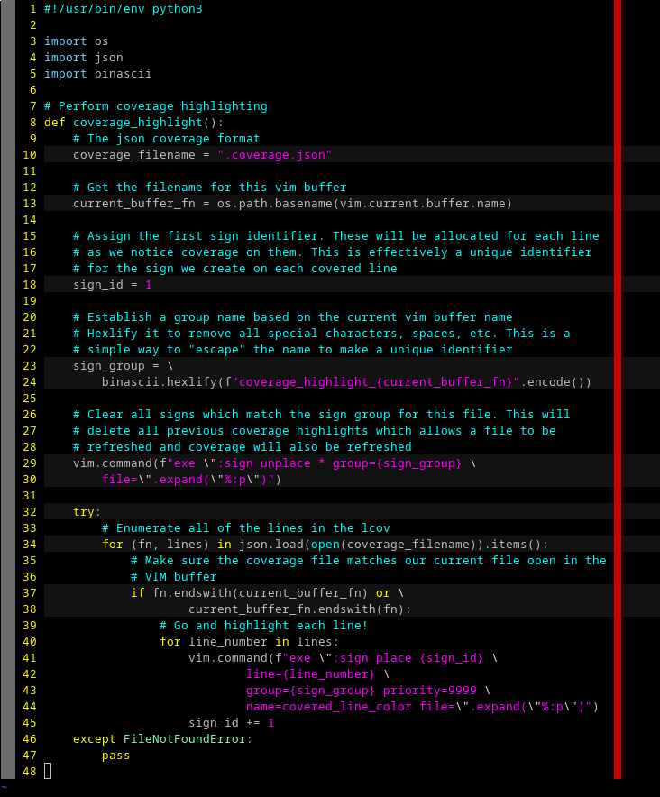

# Summary

This is a very simple source line highlighter for VIM. It takes in a basic
json file located at `.coverage.json` in the CWD, and displays highlights
lines indicated by the json!

# Coverage format

This uses an extremely simple coverage format. Just a JSON dictionary with
filenames as keys, and arrays of line numbers as values.

For example:

```
{
        "coverage_parser.py": [2, 3, 6]
}
```

The coverage file loaded is always from `.coverage.json`. I didn't even bother
making it configurable, cause it's never something that I would see myself
configuring.

The filenames are fuzzily matched between the VIM filenames and the coverage
file filenames. The comparison is just `a.endswith(b) or b.endswith(a)`. Thus,
the paths may be relative or absolute, and partial matches also will occur.

# Example



# Install

To install this, place the `coverage_parser.py` and `coverage_highlight.vim`
files into your `~/.vim/plugin/` folder. It's that easy.

